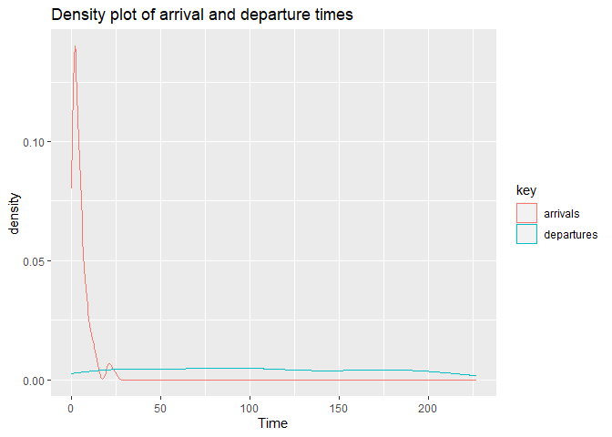

Teoria das Filas
================
Joziani Mota Vieira

As formações de filas ocorrem porque a procura pelo serviço é maior do
que a capacidade do sistema de atender a esta procura. A razão pelo qual
os gerentes dos estabelecimentos e o poder público não aumentam suas
capacidades de atendimento podem ser resumidas basicamente por dois
motivos: inviabilidade econômica e/ou limitação de espaço. <br /> Dessa
forma, a Teoria das Filas tenta através de análises matemáticas
detalhadas encontrar um ponto de equilíbrio que satisfaça o cliente e
seja viável economicamente para o provedor do serviço.

# Metodologia

Os tipos de modelos de filas são definidos a partir da Notação de
Kendall, que representa cada cadeia de filas pelos símbolos da seguinte
forma: A/B/c/K/N/Z <br />

  - **A**: distribuição do tempo entre chegadas; <br />
  - **B**: disciplina de serviços; <br />
  - **c**: número de servidores; <br />
  - **K**: capacidade total de usuários no sistema; <br />
  - **N**: número de usuários potenciais em uma população fonte; <br />
  - **Z**: disciplina de atendimento. <br />

Usualmente, quando não declarados a capacidade máxima do sistema (K), e
o número de clientes a serem atendidos (N), estes serão considerados
como ilimitados. <br />

A disciplina de atendimento pode admitir duas politicas. **First In
First Out** (primeiro que entra primeiro a sair), ou fila, é a estrutura
de atendimento que bancos e hospitais utilizam pois sequem a ordem de
chegada em que os primeiros a chegarem serão os primeiros a serem
atendidos. **Last In First Out** (último que entra primeiro a sair) é a
estrutura habitualmente chamada de pilha e amplamente utilizada na
estacagem de produtos. Caso o modelo não declare qual a disciplina de
atendimento, entende-se que será utilizada a disciplina FIFO. <br />

### Modelo M/M/2

O modelo M/M/2 da notação de Kendall é uma parametrização simples. Neste
caso, a distribuição do tempo entre novas chegadas de clientes ao
sistema é suposta exponencial (M). O tempo necessário para realizar cada
serviço também segue uma distribuição exponencial (M). A capacidade
máxima do sistema e a população fonte são supostamente infinitas. Nas
aplicações desse modelo, denotamos por lambda e mu a taxa média de
chegada e de atendimento, respectivamente. Além disso, supomos que há
dois servidores e que a disciplina da fila é FIFO.

# Exemplo

``` r
rm(list = ls())

if(!require(queuecomputer)){install.packages("queuecomputer");require(queuecomputer)}
```

    ## Loading required package: queuecomputer

``` r
if(!require(ggplot2)){install.packages("ggplot2");require(ggplot2)}
```

    ## Loading required package: ggplot2

``` r
# Taxa de chegada
l = c(1/10, 1/3, 1/5, 1/8, 1/8, 1/5, 1/3)
# Taxa de Serviço
mu = 1/5
# Duração da simulação
duration = 60
time=0
# Chegadas antes do banco abrir
T1 = 0
while(time<duration){
  T1 = c(T1,ceiling(rexp(1, rate = l[1])))
  time <- sum(T1)
}
T1=T1[-length(T1)]
time <- sum(T1)
nEvents = length(T1) # número total de eventos ocorridos
antes=nEvents #número de pessoas que chegaram antes do banco abrir

#simulando as chegadas nas proximas 6 horas
for (i in 2:7) {
  while(time<duration*i){
    T1 = c(T1,(ceiling(rexp(1, rate = l[i]))))
    time <- sum(T1)
  }
  T1=T1[-length(T1)]
}
T1=T1[-length(T1)]
T1
```

    ##  [1]  0  4 21 21  1  7  5  1  4  2  2  4  5  1  1  1  2  1  1  5  1  1  2
    ## [24]  1 13  7  1 11  5  3  2  1  2  1  7  5 10  8  1  2  5  5  2 14  9  2
    ## [47]  8  4  5  9  3  4 24  6 13  9  1  1  4  2  2  4  2  8 11  3  7  1  3
    ## [70]  4  4  2  4  1  2  5  2  1  1  2  1  1 11  6  5  3  2  7

``` r
time <- sum(T1)
time
```

    ## [1] 408

``` r
nEvents = length(T1)
nEvents
```

    ## [1] 88

``` r
#simulando os atendimentos
atend = ceiling(rexp(1, rate = mu))

for (i in 2:nEvents) {
  atend=c(atend,ceiling(rexp(1, rate = mu)))
}
atend
```

    ##  [1]  6  2 10  1  1  1  7  6  7 10  4  7 15  8  1  1  6  7  6  1  2  5  7
    ## [24]  1 13  6  4  1 20  1  4  1  3  4  3 13  2  9  1  3  3  4  7  2  8  4
    ## [47]  6  4  1  7  2  1 16  9  4  3  1  5  1 14  6  1  5  6  5  3  5  4  7
    ## [70]  6  3  3  8  2  3 10  1 10 11  1  2  5  1  2  1  4 10  6

``` r
atend_antes=c(atend[1:antes])
atend_antes
```

    ## [1]  6  2 10  1  1  1  7

``` r
#Simulação de Chegadas
print("Simulação de Chegadas")
```

    ## [1] "Simulação de Chegadas"

``` r
cat("Chegada 1:" ,T1[1], "minutos", "\n")
```

    ## Chegada 1: 0 minutos

``` r
for (i in 2:nEvents) {
  a=i-1
  cat("Chegada" , i,":" ,T1[i], "minutos","após chegada" ,a, "\n")
}
```

    ## Chegada 2 : 4 minutos após chegada 1 
    ## Chegada 3 : 21 minutos após chegada 2 
    ## Chegada 4 : 21 minutos após chegada 3 
    ## Chegada 5 : 1 minutos após chegada 4 
    ## Chegada 6 : 7 minutos após chegada 5 
    ## Chegada 7 : 5 minutos após chegada 6 
    ## Chegada 8 : 1 minutos após chegada 7 
    ## Chegada 9 : 4 minutos após chegada 8 
    ## Chegada 10 : 2 minutos após chegada 9 
    ## Chegada 11 : 2 minutos após chegada 10 
    ## Chegada 12 : 4 minutos após chegada 11 
    ## Chegada 13 : 5 minutos após chegada 12 
    ## Chegada 14 : 1 minutos após chegada 13 
    ## Chegada 15 : 1 minutos após chegada 14 
    ## Chegada 16 : 1 minutos após chegada 15 
    ## Chegada 17 : 2 minutos após chegada 16 
    ## Chegada 18 : 1 minutos após chegada 17 
    ## Chegada 19 : 1 minutos após chegada 18 
    ## Chegada 20 : 5 minutos após chegada 19 
    ## Chegada 21 : 1 minutos após chegada 20 
    ## Chegada 22 : 1 minutos após chegada 21 
    ## Chegada 23 : 2 minutos após chegada 22 
    ## Chegada 24 : 1 minutos após chegada 23 
    ## Chegada 25 : 13 minutos após chegada 24 
    ## Chegada 26 : 7 minutos após chegada 25 
    ## Chegada 27 : 1 minutos após chegada 26 
    ## Chegada 28 : 11 minutos após chegada 27 
    ## Chegada 29 : 5 minutos após chegada 28 
    ## Chegada 30 : 3 minutos após chegada 29 
    ## Chegada 31 : 2 minutos após chegada 30 
    ## Chegada 32 : 1 minutos após chegada 31 
    ## Chegada 33 : 2 minutos após chegada 32 
    ## Chegada 34 : 1 minutos após chegada 33 
    ## Chegada 35 : 7 minutos após chegada 34 
    ## Chegada 36 : 5 minutos após chegada 35 
    ## Chegada 37 : 10 minutos após chegada 36 
    ## Chegada 38 : 8 minutos após chegada 37 
    ## Chegada 39 : 1 minutos após chegada 38 
    ## Chegada 40 : 2 minutos após chegada 39 
    ## Chegada 41 : 5 minutos após chegada 40 
    ## Chegada 42 : 5 minutos após chegada 41 
    ## Chegada 43 : 2 minutos após chegada 42 
    ## Chegada 44 : 14 minutos após chegada 43 
    ## Chegada 45 : 9 minutos após chegada 44 
    ## Chegada 46 : 2 minutos após chegada 45 
    ## Chegada 47 : 8 minutos após chegada 46 
    ## Chegada 48 : 4 minutos após chegada 47 
    ## Chegada 49 : 5 minutos após chegada 48 
    ## Chegada 50 : 9 minutos após chegada 49 
    ## Chegada 51 : 3 minutos após chegada 50 
    ## Chegada 52 : 4 minutos após chegada 51 
    ## Chegada 53 : 24 minutos após chegada 52 
    ## Chegada 54 : 6 minutos após chegada 53 
    ## Chegada 55 : 13 minutos após chegada 54 
    ## Chegada 56 : 9 minutos após chegada 55 
    ## Chegada 57 : 1 minutos após chegada 56 
    ## Chegada 58 : 1 minutos após chegada 57 
    ## Chegada 59 : 4 minutos após chegada 58 
    ## Chegada 60 : 2 minutos após chegada 59 
    ## Chegada 61 : 2 minutos após chegada 60 
    ## Chegada 62 : 4 minutos após chegada 61 
    ## Chegada 63 : 2 minutos após chegada 62 
    ## Chegada 64 : 8 minutos após chegada 63 
    ## Chegada 65 : 11 minutos após chegada 64 
    ## Chegada 66 : 3 minutos após chegada 65 
    ## Chegada 67 : 7 minutos após chegada 66 
    ## Chegada 68 : 1 minutos após chegada 67 
    ## Chegada 69 : 3 minutos após chegada 68 
    ## Chegada 70 : 4 minutos após chegada 69 
    ## Chegada 71 : 4 minutos após chegada 70 
    ## Chegada 72 : 2 minutos após chegada 71 
    ## Chegada 73 : 4 minutos após chegada 72 
    ## Chegada 74 : 1 minutos após chegada 73 
    ## Chegada 75 : 2 minutos após chegada 74 
    ## Chegada 76 : 5 minutos após chegada 75 
    ## Chegada 77 : 2 minutos após chegada 76 
    ## Chegada 78 : 1 minutos após chegada 77 
    ## Chegada 79 : 1 minutos após chegada 78 
    ## Chegada 80 : 2 minutos após chegada 79 
    ## Chegada 81 : 1 minutos após chegada 80 
    ## Chegada 82 : 1 minutos após chegada 81 
    ## Chegada 83 : 11 minutos após chegada 82 
    ## Chegada 84 : 6 minutos após chegada 83 
    ## Chegada 85 : 5 minutos após chegada 84 
    ## Chegada 86 : 3 minutos após chegada 85 
    ## Chegada 87 : 2 minutos após chegada 86 
    ## Chegada 88 : 7 minutos após chegada 87

``` r
#Simulação de Atendimentos
print("Simulação de Atendimentos")
```

    ## [1] "Simulação de Atendimentos"

``` r
cat("Atendimento 1: " ,atend[1], "minutos", "\n")
```

    ## Atendimento 1:  6 minutos

``` r
for (i in 2:nEvents) cat("Atendimento" ,i,":" ,atend[i], "minutos","\n")
```

    ## Atendimento 2 : 2 minutos 
    ## Atendimento 3 : 10 minutos 
    ## Atendimento 4 : 1 minutos 
    ## Atendimento 5 : 1 minutos 
    ## Atendimento 6 : 1 minutos 
    ## Atendimento 7 : 7 minutos 
    ## Atendimento 8 : 6 minutos 
    ## Atendimento 9 : 7 minutos 
    ## Atendimento 10 : 10 minutos 
    ## Atendimento 11 : 4 minutos 
    ## Atendimento 12 : 7 minutos 
    ## Atendimento 13 : 15 minutos 
    ## Atendimento 14 : 8 minutos 
    ## Atendimento 15 : 1 minutos 
    ## Atendimento 16 : 1 minutos 
    ## Atendimento 17 : 6 minutos 
    ## Atendimento 18 : 7 minutos 
    ## Atendimento 19 : 6 minutos 
    ## Atendimento 20 : 1 minutos 
    ## Atendimento 21 : 2 minutos 
    ## Atendimento 22 : 5 minutos 
    ## Atendimento 23 : 7 minutos 
    ## Atendimento 24 : 1 minutos 
    ## Atendimento 25 : 13 minutos 
    ## Atendimento 26 : 6 minutos 
    ## Atendimento 27 : 4 minutos 
    ## Atendimento 28 : 1 minutos 
    ## Atendimento 29 : 20 minutos 
    ## Atendimento 30 : 1 minutos 
    ## Atendimento 31 : 4 minutos 
    ## Atendimento 32 : 1 minutos 
    ## Atendimento 33 : 3 minutos 
    ## Atendimento 34 : 4 minutos 
    ## Atendimento 35 : 3 minutos 
    ## Atendimento 36 : 13 minutos 
    ## Atendimento 37 : 2 minutos 
    ## Atendimento 38 : 9 minutos 
    ## Atendimento 39 : 1 minutos 
    ## Atendimento 40 : 3 minutos 
    ## Atendimento 41 : 3 minutos 
    ## Atendimento 42 : 4 minutos 
    ## Atendimento 43 : 7 minutos 
    ## Atendimento 44 : 2 minutos 
    ## Atendimento 45 : 8 minutos 
    ## Atendimento 46 : 4 minutos 
    ## Atendimento 47 : 6 minutos 
    ## Atendimento 48 : 4 minutos 
    ## Atendimento 49 : 1 minutos 
    ## Atendimento 50 : 7 minutos 
    ## Atendimento 51 : 2 minutos 
    ## Atendimento 52 : 1 minutos 
    ## Atendimento 53 : 16 minutos 
    ## Atendimento 54 : 9 minutos 
    ## Atendimento 55 : 4 minutos 
    ## Atendimento 56 : 3 minutos 
    ## Atendimento 57 : 1 minutos 
    ## Atendimento 58 : 5 minutos 
    ## Atendimento 59 : 1 minutos 
    ## Atendimento 60 : 14 minutos 
    ## Atendimento 61 : 6 minutos 
    ## Atendimento 62 : 1 minutos 
    ## Atendimento 63 : 5 minutos 
    ## Atendimento 64 : 6 minutos 
    ## Atendimento 65 : 5 minutos 
    ## Atendimento 66 : 3 minutos 
    ## Atendimento 67 : 5 minutos 
    ## Atendimento 68 : 4 minutos 
    ## Atendimento 69 : 7 minutos 
    ## Atendimento 70 : 6 minutos 
    ## Atendimento 71 : 3 minutos 
    ## Atendimento 72 : 3 minutos 
    ## Atendimento 73 : 8 minutos 
    ## Atendimento 74 : 2 minutos 
    ## Atendimento 75 : 3 minutos 
    ## Atendimento 76 : 10 minutos 
    ## Atendimento 77 : 1 minutos 
    ## Atendimento 78 : 10 minutos 
    ## Atendimento 79 : 11 minutos 
    ## Atendimento 80 : 1 minutos 
    ## Atendimento 81 : 2 minutos 
    ## Atendimento 82 : 5 minutos 
    ## Atendimento 83 : 1 minutos 
    ## Atendimento 84 : 2 minutos 
    ## Atendimento 85 : 1 minutos 
    ## Atendimento 86 : 4 minutos 
    ## Atendimento 87 : 10 minutos 
    ## Atendimento 88 : 6 minutos

``` r
filas <- queue_step(arrivals=T1, service=atend, servers=2)
filas
```

    ## # A tibble: 88 x 6
    ##    arrivals service departures waiting system_time server
    ##       <dbl>   <dbl>      <dbl>   <dbl>       <dbl>  <int>
    ##  1        0       6          6       0           6      1
    ##  2        4       2        103      97          99      2
    ##  3       21      10        217     186         196      1
    ##  4       21       1        211     189         190      2
    ##  5        1       1          2       0           1      2
    ##  6        7       1        165     157         158      1
    ##  7        5       7        126     114         121      1
    ##  8        1       6          8       1           7      2
    ##  9        4       7        109      98         105      1
    ## 10        2      10         55      43          53      2
    ## # ... with 78 more rows

``` r
summary(filas)
```

    ## Total customers:
    ##  88
    ## Missed customers:
    ##  0
    ## Mean waiting time:
    ##  95.8
    ## Mean response time:
    ##  101
    ## Utilization factor:
    ##  0.975770925110132
    ## Mean queue length:
    ##  40
    ## Mean number of customers in system:
    ##  39.1

## Gráficos

``` r
## parcelas de densidade dos horários de chegada e partida
plot(filas, which = 1)
```

    ## [[1]]

<!-- -->

``` r
## histogramas dos horários de chegada e partida
plot(filas, which = 2)
```

    ## [[1]]

<!-- -->

``` r
## gráficos de densidade de tempos de espera e sistema
plot(filas, which = 3)
```

    ## [[1]]

<!-- -->

``` r
## função da etapa do comprimento da fila
plot(filas, which = 4)
```

    ## [[1]]

<!-- -->

``` r
## gráfico de intervalo de linhas do status do cliente e do servidor
plot(filas, which = 5)
```

    ## [[1]]

<!-- -->

``` r
## gráfico de distribuição empírica dos horários de chegada e partida
plot(filas, which = 6)
```

    ## [[1]]

<!-- -->
